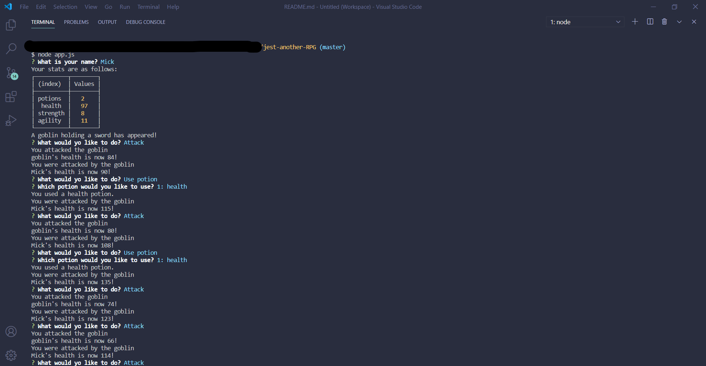
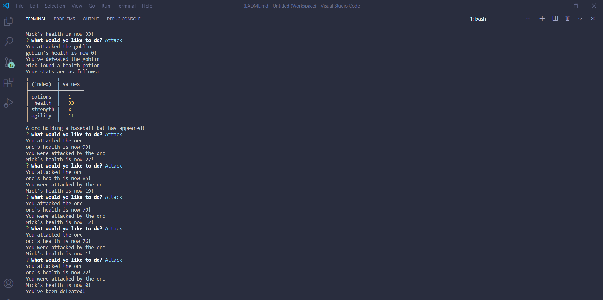

# Jest Another RPG

## Description
A Node.js-powered command line Role Playing Game allowing the user to battle a variety of mythical creatures with imaginary weapons.

##### Game Start View

##### Game Over View

## Table of Contents
  * [Installation](#installation)
  * [Usage](#usage)
  * [License](#license)
  * [Technologies](#technologies)
  * [Contributing](#contributing)
  * [Testing](#testing)
  * [Questions](#questions)
  
## Installation
Clone project to a directory on your local machine and cd into jest-another-RPG directory.  Run <$ npm install> to install dependencies.  See package.json for other available scripts.

## Usage
Run <$ npm start> to launch application in terminal.  Answer questions as appropriate and follow closely to determine the victor in your battle.  

## License 
This project is covered under the MIT license 

## Technologies 
Node.js, Inquirer, Jest

## Contributing
To see the guidelines adopted for contributing to this project, please view the [Contributor Covenant](https://www.contributor-covenant.org/version/2/0/code_of_conduct/code_of_conduct.txt)

## Testing
Run <$ npm run test> from the root directory of the project.

## Questions
Visit me at GitHub  
[christopherConcannon](https://github.com/christopherConcannon)
  
If you have any questions or would like to contact me, please email me at  
[cmcon@yahoo.com](mailto:cmcon@yahoo.com)
